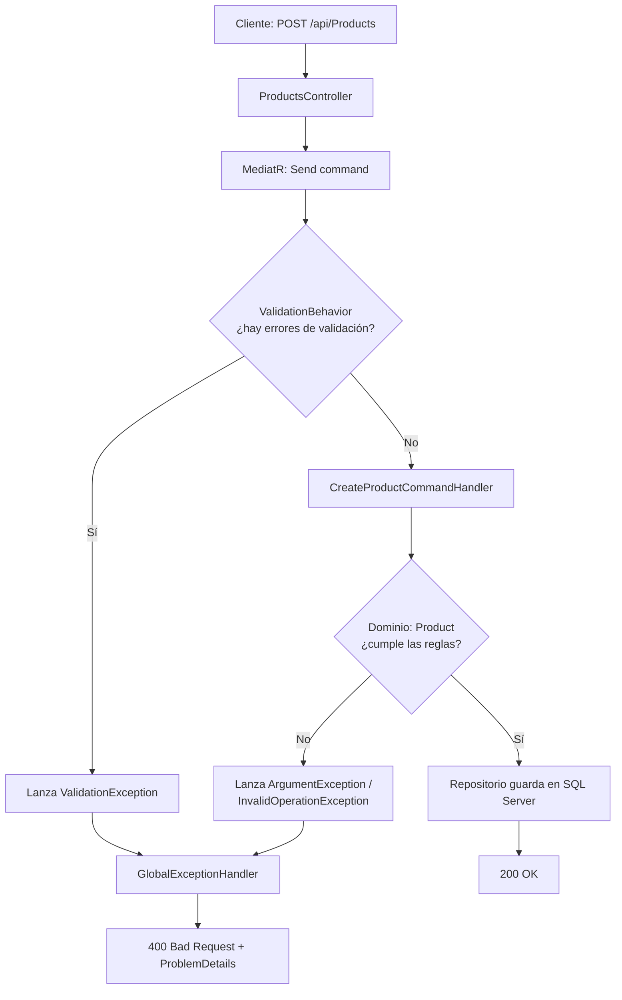

# ProductAPI – Rama feature/error-handling-validation

Manejo global de excepciones (IExceptionHandler), validación de entrada con FluentValidation y ejecución automática de las validaciones mediante un Pipeline Behavior de MediatR, en una Arquitectura Limpia con .NET 8.

## Tabla de contenidos
1. [Objetivo de la rama](#1-objetivo-de-la-rama)
2. [Punto de partida y problema a resolver](#2-punto-de-partida-y-problema-a-resolver)
3. [Visión general: dos niveles de defensa](#3-visión-general-dos-niveles-de-defensa)
4. [Desarrollo paso a paso](#4-desarrollo-paso-a-paso)
5. [FluentValidation: validadores](#5-fluentvalidation-validadores)
6. [Pipeline Behavior: el interceptor de MediatR](#6-pipeline-behavior-el-interceptor-de-mediatr)
7. [Manejo global de excepciones](#7-manejo-global-de-excepciones)
8. [Registro en Program.cs](#8-registro-en-programcs)
9. [Respuestas HTTP y ProblemDetails](#9-respuestas-http-y-problemdetails)
10. [Cómo probarlo](#10-cómo-probarlo)
11. [Mapa de errores: qué devuelve cada situación](#11-mapa-de-errores-qué-devuelve-cada-situación)
12. [Beneficios arquitectónicos](#12-beneficios-arquitectónicos)
13. [Decisiones de diseño y limitaciones conocidas](#13-decisiones-de-diseño-y-limitaciones-conocidas)
14. [Glosario](#14-glosario)
15. [Próximos pasos](#15-próximos-pasos)

---

## 1. Objetivo de la rama
Aumentar la madurez y resiliencia de la API. Antes de esta rama, cualquier error de validación o de reglas del dominio terminaba en un genérico `500 Internal Server Error`.

Se implementó:

| Pieza | Capa | Responsabilidad |
| --- | --- | --- |
| `GlobalExceptionHandler` (IExceptionHandler) | **Api** | Capturar excepciones sin try/catch en los controladores y traducirlas a respuestas HTTP |
| Validadores (`AbstractValidator<T>`) | **Application** | Declarar las reglas de entrada de cada comando |
| `ValidationBehavior` (IPipelineBehavior) | **Application** | Ejecutar los validadores automáticamente antes de cada handler |
| `ProblemDetails` | **Api** | Formato estándar de errores para los clientes |

---

## 2. Punto de partida y problema a resolver
Si se enviaba un producto con precio `-10`, la capa de dominio lanzaba una `ArgumentException`. Nadie la capturaba, el servidor abortaba la petición y el cliente recibía un `500`.

Esto es una mala práctica por dos motivos:
1. **Semántica HTTP incorrecta:** un `500` significa "el servidor falló", pero el error lo causó el cliente al enviar datos inválidos (corresponde un `400 Bad Request`).
2. **Código repetido:** poner `try/catch` en cada controlador ensucia el código y viola el principio DRY (Don't Repeat Yourself).

---

## 3. Visión general: dos niveles de defensa

Los datos inválidos se detienen en dos puntos distintos, con responsabilidades diferentes:

| Nivel | Dónde | Qué valida | Ejemplo |
| --- | --- | --- | --- |
| **1. Validación de entrada** | Application (FluentValidation) | Que el comando venga completo y con formato correcto | Nombre vacío, Guid vacío |
| **2. Reglas de negocio** | Domain (entidades) | Que el estado de la entidad sea siempre consistente | Precio negativo, stock insuficiente |

El nivel 1 evita llegar al dominio con datos evidentemente malos. El nivel 2 garantiza que, aunque alguien llame al dominio desde otro lugar, las reglas se cumplan. No se duplican: se complementan.

**Recorrido de una petición**


---

## 4. Desarrollo paso a paso

### 4.1 Crear la rama
```bash
git checkout main
git pull origin main
git checkout -b feature/error-handling-validation
```

### 4.2 Instalar FluentValidation en la capa Application
```bash
dotnet add ProductAPI.Application package FluentValidation
dotnet add ProductAPI.Application package FluentValidation.DependencyInjectionExtensions
```

### 4.3 Crear los archivos
Se crearon validadores, Behaviors y Middlewares en las capas correspondientes.

### 4.4 Implementar, en este orden
1. Validadores → sección 5
2. ValidationBehavior → sección 6
3. GlobalExceptionHandler → sección 7
4. Registro en Program.cs → sección 8

### 4.5 Compilar y probar
```bash
dotnet build
dotnet run --project ProductAPI.Api
```

### 4.6 Commits y Pull Request
```bash
git add .
git commit -m "feat: add global exception handling and FluentValidation pipeline behavior"
git push -u origin feature/error-handling-validation
```

---

## 5. FluentValidation: validadores

**Archivo:** `ProductAPI.Application/Features/Products/Commands/CreateProduct/CreateProductCommandValidator.cs`

```csharp
using FluentValidation;

public class CreateProductCommandValidator : AbstractValidator<CreateProductCommand>
{
    public CreateProductCommandValidator()
    {
        RuleFor(p => p.Name)
            .NotEmpty().WithMessage("El nombre del producto es obligatorio.")
            .MaximumLength(100);

        RuleFor(p => p.Price)
            .GreaterThan(0).WithMessage("El precio debe ser mayor a 0.");
            
        // ... más reglas (stock, categoryId, brandId)
    }
}
```

**Validación de entrada vs. regla de dominio**
| | Validador (Application) | Dominio (Product) |
| --- | --- | --- |
| **Precio** | `.GreaterThan(0)`: rechaza 0 | `UpdatePrice`: rechaza solo negativos |
| **Qué protege** | La entrada de la API | El estado de la entidad |

*Que el validador sea más estricto que el dominio es válido: el validador expresa una regla de entrada, y el dominio mantiene su invariante mínima.*

---

## 6. Pipeline Behavior: el interceptor de MediatR

Tener un validador no sirve si nadie lo ejecuta. En lugar de inyectarlo en cada handler y llamar a `.Validate()`, se usa un **Pipeline Behavior**: un middleware interno de MediatR que envuelve a todos los handlers.

**Archivo:** `ProductAPI.Application/Behaviors/ValidationBehavior.cs`

### 6.1 Qué hace
1. Recibe el mensaje (Command o Query).
2. Busca los validadores registrados para ese tipo de mensaje.
3. Los ejecuta en paralelo.
4. Si hay errores, lanza una `ValidationException` y corta el flujo: el handler nunca se ejecuta.
5. Si no hay errores, llama a `next()` para continuar hacia el handler.

---

## 7. Manejo global de excepciones

A partir de .NET 8, la forma recomendada de manejar excepciones de forma centralizada es implementar `IExceptionHandler`.

**Archivo:** `ProductAPI.Api/Middlewares/GlobalExceptionHandler.cs`

### 7.1 Mapeo de excepciones a códigos HTTP
| Excepción | Origen | Código | Title |
| --- | --- | --- | --- |
| `ValidationException` | ValidationBehavior | 400 | Error de validación |
| `ArgumentException` | Dominio (precio, stock) | 400 | Error de regla de negocio |
| `InvalidOperationException` | Dominio (stock insuficiente) | 400 | Error de regla de negocio |
| Cualquier otra | Base de datos, bugs, etc. | 500 | Error interno del servidor |

---

## 8. Registro en Program.cs

```csharp
// --- Servicios ---
builder.Services.AddProblemDetails();
builder.Services.AddExceptionHandler<GlobalExceptionHandler>();

// Registrar todos los validadores del ensamblado de Application
builder.Services.AddValidatorsFromAssembly(typeof(CreateProductCommand).Assembly);

// MediatR + el behavior de validación
builder.Services.AddMediatR(cfg => {
    cfg.RegisterServicesFromAssembly(typeof(CreateProductCommand).Assembly);
    cfg.AddOpenBehavior(typeof(ValidationBehavior<,>));
});

// --- Pipeline HTTP ---
var app = builder.Build();

app.UseExceptionHandler(); // debe ir ANTES del resto de middlewares

// ...
```

---

## 9. Respuestas HTTP y ProblemDetails

ProblemDetails es el formato estándar para describir errores en APIs HTTP (definido en RFC 7807, actualizado por RFC 9457). Da a los clientes web y móviles una estructura de error predecible.

### 9.1 Ejemplo de respuesta de validación
```json
{
  "type": "https://tools.ietf.org/html/rfc9110#section-15.5.1",
  "title": "Error de validación de datos de entrada",
  "status": 400,
  "detail": "Uno o más campos tienen errores de validación.",
  "errors": [
    {
      "propertyName": "Name",
      "errorMessage": "El nombre del producto es obligatorio."
    }
  ]
}
```

---

## 10. Cómo probarlo

### 10.1 Prueba principal: varios errores a la vez
En Swagger, abrir `POST /api/Products`. Enviar:
```json
{
  "name": "",
  "description": "Prueba",
  "price": -1500,
  "stock": -5,
  "categoryId": "00000000-0000-0000-0000-000000000000",
  "brandId": "00000000-0000-0000-0000-000000000000"
}
```
**Resultado esperado:** `400 Bad Request` con un `ProblemDetails` que lista todos los errores a la vez, en lugar de un `500`.

---

## 11. Mapa de errores: qué devuelve cada situación

| Situación | Dónde se detecta | Excepción | Respuesta |
| --- | --- | --- | --- |
| Nombre vacío / precio ≤ 0 | ValidationBehavior | ValidationException | 400 + lista de errores |
| Precio negativo en dominio | Product.UpdatePrice | ArgumentException | 400 + mensaje |
| Retirar más stock del | Product.RemoveStock | InvalidOperationException | 400 + mensaje |
| JSON mal formado | Model binding de ASP.NET | (ninguna) | 400 automático |
| CategoryId inexistente | Base de datos (FK) | Excepción de EF Core | 500 |
| Error inesperado | Cualquier capa | Otra excepción | 500 |

---

## 12. Beneficios arquitectónicos
* **Fail-fast:** las peticiones inválidas se rechazan antes de crear entidades o abrir conexiones.
* **Controladores puros:** No hay `if (!ModelState.IsValid)` ni `try/catch`.
* **Manejo centralizado:** para enviar los errores a Sentry o DataDog, solo se modifica el `GlobalExceptionHandler`.
* **Respuestas consistentes:** todos los errores salen en el mismo formato `ProblemDetails`.

---

## 13. Decisiones de diseño y limitaciones conocidas
| Tema | Estado actual | Mejora sugerida |
| --- | --- | --- |
| Excepciones nativas a 400 | Atrapa genéricas como `ArgumentException` | Crear excepciones propias de dominio (ej. `DomainException`) |
| Stock insuficiente | Responde 400 | `409 Conflict` suele describir mejor un conflicto |
| Id inexistente | Sigue siendo 500 (FK de BD) | Verificar existencia en el handler y responder `404` |

---

## 14. Glosario
| Término | Definición |
| --- | --- |
| **IExceptionHandler** | Interfaz de .NET 8 para manejar excepciones de forma centralizada |
| **ProblemDetails** | Formato estándar JSON para describir errores en APIs HTTP |
| **FluentValidation** | Librería para declarar reglas de validación encadenadas |
| **Pipeline Behavior** | Componente de MediatR que se ejecuta antes/después de un handler |

---

## 15. Próximos pasos
* Excepciones de dominio propias para mapear códigos HTTP con precisión (400, 404, 409).
* Verificar la existencia de `CategoryId` y `BrandId` y responder `404`.
* Pruebas unitarias de validadores y del `ValidationBehavior`.
* `201 Created` en las operaciones de creación.
* Paginación y filtros en las consultas de listado.
