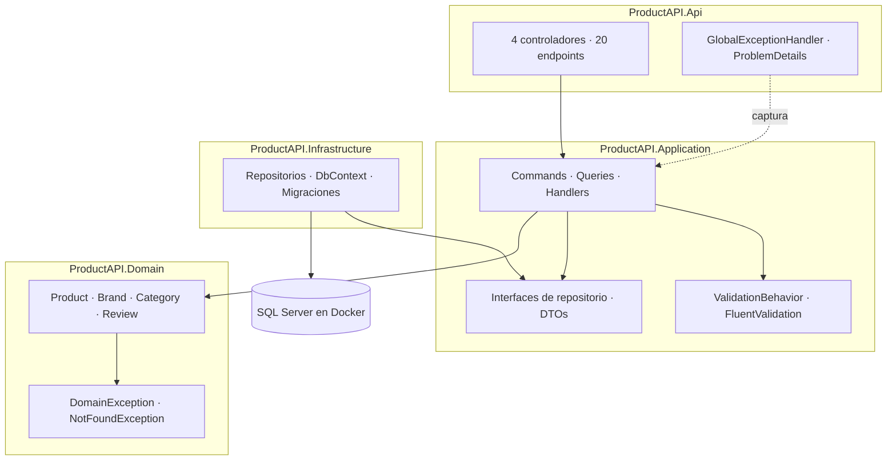

# ProductAPI – Rama feature/full-crud-all-entities

Rama final de la fase inicial del proyecto: extiende y estandariza el CRUD completo (Create, Read, Update, Delete) a las entidades restantes, Brands, Categories y Reviews, replicando el patrón ya implementado para Product con Clean Architecture, CQRS y MediatR.

## Tabla de contenidos
1. [Objetivo de la rama](#1-objetivo-de-la-rama)
2. [Punto de partida y alcance](#2-punto-de-partida-y-alcance)
3. [Resumen de cambios](#3-resumen-de-cambios)
4. [Desarrollo paso a paso](#4-desarrollo-paso-a-paso)
5. [Repositorios](#5-repositorios)
6. [Casos de uso (Application)](#6-casos-de-uso-application)
7. [Controladores (Api)](#7-controladores-api)
8. [Referencia de endpoints](#8-referencia-de-endpoints)
9. [Cómo probarlo paso a paso](#9-cómo-probarlo-paso-a-paso)
10. [Mapa de respuestas HTTP](#10-mapa-de-respuestas-http)
11. [Estado final del proyecto](#11-estado-final-del-proyecto)
12. [Decisiones de diseño y limitaciones conocidas](#12-decisiones-de-diseño-y-limitaciones-conocidas)
13. [Próximos pasos detallados](#13-próximos-pasos-detallados)
14. [Glosario](#14-glosario)

---

## 1. Objetivo de la rama
Hasta `feature/product-full-crud`, solo Product tenía un ciclo de vida completo. Las demás entidades solo podían crearse (y, en algunos casos, listarse).
Esta rama aplica el mismo patrón a Brand, Category y Review, de modo que las cuatro entidades exponen la misma interfaz REST, con las mismas convenciones de códigos HTTP y el mismo manejo de errores.

---

## 2. Punto de partida y alcance

| Ya existía | Se agrega en esta rama |
| --- | --- |
| CRUD completo de Product | CRUD completo de Brand, Category y Review |
| POST y listado en otras 3 | `GET /{id}`, `PUT /{id}`, `DELETE /{id}` |
| `NotFoundException` y errores globales | Se reutilizan sin cambios |
| `CreatedAtAction` en Products | `CreatedAtAction` en las otras tres |

| Incluye | No incluye |
| --- | --- |
| GetById, Update, Delete en 3 entidades | Eliminación lógica (soft delete) |
| Eliminación física | Paginación y filtros |
| Respuestas estandarizadas (201, 200, 204, 404) | Control de concurrencia |

---

## 3. Resumen de cambios
Por cada entidad (Brand, Category, Review) se agregó lo mismo:

| Capa | Elemento | Archivos por entidad |
| --- | --- | --- |
| Application | Interfaz extendida (`GetByIdAsync`, `Update`, `Delete`) | modifica 1 |
| Infrastructure | Implementación de EF Core | modifica 1 |
| Application | `Get{Entidad}ByIdQuery` + handler | 2 nuevos |
| Application | `Update{Entidad}Command` + handler | 2 nuevos |
| Application | `Delete{Entidad}Command` + handler | 2 nuevos |
| Api | Controlador refactorizado (5 endpoints) | modifica 1 |

---

## 4. Desarrollo paso a paso

### 4.1 Crear la rama
```bash
git checkout main
git pull origin main
git checkout -b feature/full-crud-all-entities
```

### 4.2 Extender los repositorios
Agregar métodos en `IBrandRepository`, `ICategoryRepository` y `IReviewRepository`, e implementarlos en Infrastructure.

### 4.3 Crear los casos de uso
Repetir para Brand, Category y Review: `GetByIdQuery`, `UpdateCommand`, `DeleteCommand`.

### 4.4 Refactorizar los controladores
Agregar los endpoints correspondientes y usar `CreatedAtAction` en los POST.

### 4.5 Compilar y Probar
```bash
dotnet build
dotnet test
```

### 4.6 Commits y Pull Request
```bash
git add .
git commit -m "feat: add full CRUD for Brand, Category and Review"
git push -u origin feature/full-crud-all-entities
```

---

## 5. Repositorios
Las interfaces siguen viviendo en Application y las implementaciones en Infrastructure, respetando la inversión de dependencias.

| Operación | Propósito |
| --- | --- |
| `GetByIdAsync` | Busca entidad por Guid. Devuelve valor nullable. |
| `Update` | Marca entidad como modificada. |
| `Delete` | Elimina la entidad físicamente de BD. |

---

## 6. Casos de uso (Application)
Flujo estándar implementado:
1. Cliente envía GET/PUT/DELETE.
2. Controlador envía mensaje por MediatR.
3. Handler consulta `GetByIdAsync`.
4. Si no existe -> `throw new NotFoundException` -> Global Middleware -> 404.
5. Si existe -> ejecuta lógica -> Guarda -> Retorna.

---

## 7. Controladores (Api)
Estructura unificada para todos los controladores:
* `POST /`: Devuelve `201 Created` con `Location`.
* `GET /`: Devuelve `200 OK`.
* `GET /{id}`: Devuelve `200 OK` o `404 Not Found`.
* `PUT /{id}`: Devuelve `204 NoContent`.
* `DELETE /{id}`: Devuelve `204 NoContent`.

---

## 8. Referencia de endpoints
Con Products, la API tiene 20 endpoints en total (4 entidades × 5).

| Entidad | Ruta base |
| --- | --- |
| Marcas | `/api/Brands` |
| Categorías | `/api/Categories` |
| Reseñas | `/api/Reviews` |
| Productos | `/api/Products` |

---

## 9. Cómo probarlo paso a paso
* Levanta SQL Server (Docker) y ejecuta migraciones.
* Lanza API: `dotnet run --project ProductAPI.Api`
* Ve a `https://localhost:<puerto>/swagger` y prueba a crear, buscar, editar y eliminar cada una de las 4 entidades.

---

## 10. Mapa de respuestas HTTP

| Situación | Origen | Código |
| --- | --- | --- |
| Creado | POST | 201 + Location |
| Encontrado | GET /{id} | 200 |
| Actualizado / Borrado | PUT / DELETE | 204 |
| Id inexistente | `NotFoundException` | 404 |
| Inválido | `ValidationException` / `DomainException` | 400 |
| Error Sistema / FK | EF Core / Fallos | 500 |

---

## 11. Estado final del proyecto

### 11.1 Evolución por ramas
1. `main`: Solución 4 capas
2. `feature/product-domain`: Entidades
3. `feature/ef-core-sqlserver`: Base de Datos
4. `feature/product-usecases`: CQRS + Repositorios
5. `feature/error-handling-validation`: Validaciones y Middleware
6. `feature/domain-exceptions`: Excepciones personalizadas
7. `feature/product-full-crud`: CRUD de Product
8. `feature/full-crud-all-entities`: **CRUD de todas (ESTA)**

### 11.2 Arquitectura


---

## 12. Decisiones de diseño y limitaciones conocidas
* **Eliminar Categoría con Productos:** Depende de configuración EF Core (Cascada vs Restrictiva).
* **Eliminación Física:** Los datos no se pueden recuperar.
* **Llaves foráneas rotas:** Un `ProductId` inexistente en un Review da 500.

---

## 13. Próximos pasos detallados (El futuro)
* **Soft Delete:** Usar interfaz `ISoftDeletable` y Global Query Filters de EF Core.
* **Paginación y Filtrado:** Agregar parámetros a Query en `GetAll` y retornar páginas.
* **RowVersion:** Control de concurrencia optimista para evitar sobreescritura de stock en Product.

---

## 14. Glosario
* **CRUD:** Create, Read, Update, Delete.
* **Soft Delete:** Ocultar lógicamente un registro de la BD.
* **Paginación:** Devolver páginas de registros y no millones a la vez.
* **RowVersion:** Token de SQL Server para controlar quién modifica qué, y evitar colisiones concurrentes (409 Conflict).
