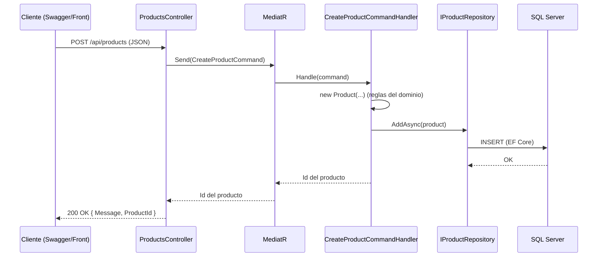

# ProductAPI – Rama feature/product-usecases

Implementación de la capa de Aplicación (casos de uso con CQRS y MediatR) y de la capa API (controladores HTTP) sobre el dominio y la persistencia ya existentes.

## Tabla de contenidos
1. [Objetivo de la rama](#1-objetivo-de-la-rama)
2. [Punto de partida y alcance](#2-punto-de-partida-y-alcance)
3. [Visión general del flujo de una petición](#3-visión-general-del-flujo-de-una-petición)
4. [Desarrollo paso a paso](#4-desarrollo-paso-a-paso)
5. [CQRS y MediatR en detalle](#5-cqrs-y-mediatr-en-detalle)
6. [Patrón Repositorio: interfaz e implementación](#6-patrón-repositorio-interfaz-e-implementación)
7. [DTOs y mapeo manual con LINQ](#7-dtos-y-mapeo-manual-con-linq)
8. [Controladores delgados](#8-controladores-delgados)
9. [Inyección de dependencias](#9-inyección-de-dependencias)
10. [Cómo probar la API](#10-cómo-probar-la-api)
11. [Manejo de errores: comportamiento actual](#11-manejo-de-errores-comportamiento-actual)
12. [Decisiones de diseño y limitaciones conocidas](#12-decisiones-de-diseño-y-limitaciones-conocidas)
13. [Glosario](#13-glosario)
14. [Próximos pasos](#14-próximos-pasos)

---

## 1. Objetivo de la rama
Hasta esta rama el proyecto tenía:
* Un dominio con reglas de negocio (Domain) → ver `feature/product-domain`.
* Una persistencia con EF Core y SQL Server en Docker (Infrastructure) → ver `feature/ef-core-sqlserver`.

Pero ninguna de las dos capas era accesible desde fuera. Esta rama las conecta:
* Crea los casos de uso en `Application`, separando comandos (escritura) y consultas (lectura) con CQRS.
* Define interfaces de repositorio en `Application` y sus implementaciones en `Infrastructure`.
* Introduce DTOs para no exponer las entidades del dominio.
* Expone todo mediante controladores HTTP en `Api`.
* Cablea las dependencias en `Program.cs`.

El flujo completo (Repositorio → Command/Query → DTO → Controller) se aplicó a las 4 entidades: `Products`, `Brands`, `Categories` y `Reviews`.

---

## 2. Punto de partida y alcance

| Incluye | No incluye |
| --- | --- |
| Comandos y consultas con MediatR | Validación de entrada (FluentValidation) |
| Interfaces `I*Repository` en Application | Manejo global de excepciones |
| Implementaciones `*Repository` en Infrastructure | Autenticación y autorización |
| DTOs y mapeo manual con LINQ | Paginación y filtros |
| Controladores para las 4 entidades | Pruebas de los casos de uso |
| Registro de dependencias en `Program.cs` | |

**Dependencias entre capas**
```text
Api ──────────► Application ──────────► Domain
 │                   ▲
 └──► Infrastructure ┘
```

| Capa | Contiene en esta rama | Depende de |
| --- | --- | --- |
| **Domain** | Entidades (sin cambios) | Nada |
| **Application** | Commands, Queries, Handlers, DTOs, interfaces de repositorio | Domain, MediatR |
| **Infrastructure** | Implementaciones de repositorio con EF Core | Application (y EF Core) |
| **Api** | Controladores y `Program.cs` | Application, Infrastructure |

**Regla de oro:** el centro (Application) nunca depende de la periferia (Infrastructure). Los handlers solo conocen la interfaz `IProductRepository`, nunca `ApplicationDbContext`.

---

## 3. Visión general del flujo de una petición



Cada capa tiene una única responsabilidad:
| Paso | Capa | Responsabilidad |
| --- | --- | --- |
| Recibir HTTP y responder HTTP | **Api** | Nada más |
| Enrutar el mensaje al manejador correcto | **MediatR** | Desacoplar controlador y caso de uso |
| Orquestar el caso de uso | **Application** (Handler) | Crear/consultar entidades y llamar al repositorio |
| Reglas de negocio | **Domain** (Entidad) | Validar precio, stock, etc. |
| Persistir | **Infrastructure** (Repositorio) | Traducir a consultas SQL con EF Core |

---

## 4. Desarrollo paso a paso

### 4.1 Crear la rama
```bash
git checkout main
git pull origin main
git checkout -b feature/product-usecases
```

### 4.2 Instalar MediatR en la capa Application
```bash
dotnet add ProductAPI.Application package MediatR
```

### 4.3 Definir las interfaces de repositorio (Application)
Se crea una interfaz por entidad (`IProductRepository`, `IBrandRepository`, `ICategoryRepository`, `IReviewRepository`). Cada una declara únicamente las operaciones que los casos de uso necesitan, por ejemplo `AddAsync` y `GetAllAsync`.

### 4.4 Crear Commands, Queries y Handlers (Application)
Para cada operación se crean dos archivos:
| Archivo | Rol | Ejemplo |
| --- | --- | --- |
| `*Command.cs` / `*Query.cs` | El mensaje: un record que solo transporta datos | `CreateProductCommand` |
| `*Handler.cs` | La lógica del caso de uso | `CreateProductCommandHandler` |

### 4.5 Crear los DTOs (Application)
Un record por entidad con solo las propiedades que se quieren exponer (por ejemplo `ProductDto`).

### 4.6 Implementar los repositorios (Infrastructure)
Se crea `ProductRepository : IProductRepository` (y los equivalentes) usando `ApplicationDbContext`.

### 4.7 Crear los controladores (Api)
Un controlador por entidad: `ProductsController`, etc., que reciben el `IMediator` por constructor.

### 4.8 Registrar dependencias en Program.cs
Ver sección 9.

### 4.9 Compilar y probar
```bash
dotnet build
dotnet run --project ProductAPI.Api
```

### 4.10 Commits y Pull Request
```bash
git add .
git commit -m "feat: add use cases, repositories and controllers with CQRS"
git push -u origin feature/product-usecases
```

---

## 5. CQRS y MediatR en detalle

### 5.1 ¿Qué es CQRS?
*Command and Query Responsibility Segregation*: separar las operaciones que modifican el sistema de las que solo leen.

| Tipo | Propósito | ¿Modifica datos? | Ejemplos |
| --- | --- | --- | --- |
| **Command** | Ordenar un cambio | Sí | Crear, actualizar, borrar |
| **Query** | Hacer una pregunta | Nunca | Obtener todos, obtener por Id |

**Beneficios:** cada caso de uso es una clase pequeña con una sola responsabilidad, es fácil de probar de forma aislada y se puede optimizar la lectura sin tocar la escritura.

### 5.2 ¿Qué es MediatR?
Librería que implementa el patrón Mediator. Funciona como un cartero: el controlador entrega un mensaje (`Command` o `Query`) y MediatR lo envía al handler que lo sabe procesar. El controlador no conoce al handler.

### 5.3 Anatomía de un caso de uso
1) El mensaje (record que solo transporta datos):
```csharp
public record CreateProductCommand(/* datos necesarios */) : IRequest<Guid>;
```

2) El manejador:
```csharp
public class CreateProductCommandHandler : IRequestHandler<CreateProductCommand, Guid>
{
    private readonly IProductRepository _repository;
    public CreateProductCommandHandler(IProductRepository repository) => _repository = repository;

    public async Task<Guid> Handle(CreateProductCommand request, CancellationToken cancellationToken)
    {
        // 1. Construir la entidad usando el constructor del dominio
        // 2. Persistir mediante el repositorio
        // 3. Devolver el Id
    }
}
```

### 5.4 Convenciones de nombres
| Elemento | Convención | Ejemplo |
| --- | --- | --- |
| Comando | `Verbo` + `Entidad` + `Command` | `CreateProductCommand` |
| Consulta | `Verbo` + `Entidad(es)` + `Query` | `GetProductsQuery` |
| Handler | `Nombre del mensaje` + `Handler` | `GetProductsQueryHandler` |

---

## 6. Patrón Repositorio: interfaz e implementación

### 6.1 El problema
Si los handlers usaran `ApplicationDbContext` directamente, la lógica de negocio quedaría acoplada a EF Core y a SQL Server, y no se podría probar sin una base de datos.

### 6.2 La solución
| Dónde | Qué | Responsabilidad |
| --- | --- | --- |
| **Application** | `IProductRepository` (interfaz) | Declara qué operaciones se necesitan, sin saber cómo |
| **Infrastructure**| `ProductRepository` (clase) | Implementa la interfaz con EF Core y consultas reales |

### 6.3 Inversión de dependencias
Infrastructure referencia a Application (no al revés). La interfaz vive en la capa interna y la implementación en la externa: ese es el principio de inversión de dependencias (la D de SOLID).

---

## 7. DTOs y mapeo manual con LINQ

### 7.1 Por qué no devolver la entidad
Las entidades del dominio no deben salir por la API porque:
* Su estructura puede cambiar por razones internas sin que el contrato de la API deba cambiar.
* Pueden contener propiedades de navegación que provocan ciclos de serialización o exponen datos no deseados.
* Acoplan a los clientes con el modelo de dominio.

En su lugar se devuelve un **DTO (Data Transfer Object)**: un record con solo lo que se quiere mostrar.

### 7.2 Mapeo con Select
En `GetProductsQueryHandler`, las entidades se transforman a DTOs con el operador `Select` de LINQ:
```csharp
var productDtos = products.Select(p => new ProductDto(
    p.Id, p.Name, p.Description, p.Price, p.Stock, p.CategoryId, p.BrandId
));
```

### 7.3 Mapeo manual vs. AutoMapper
| | Manual (LINQ) | AutoMapper |
| --- | --- | --- |
| **Control** | Total y explícito | Basado en convenciones y configuración |
| **Rendimiento**| Sin reflexión en tiempo de ejecución | Ligeramente menor |
| **Errores** | Se detectan al compilar | Algunos se detectan solo al ejecutar |
| **Recomendado**| Proyectos pequeños o medianos | Modelos con muchas propiedades |

*Se eligió el mapeo manual por transparencia y control.*

---

## 8. Controladores delgados
La capa API queda mínima: cada acción tiene pocas líneas.

```csharp
[HttpPost]
public async Task<IActionResult> CreateProduct([FromBody] CreateProductCommand command)
{
    var productId = await _mediator.Send(command); // 1. Delegar a MediatR
    return Ok(new { Message = "Producto creado", ProductId = productId }); // 2. Responder 200 OK
}
```

| El controlador hace | El controlador no hace |
| --- | --- |
| Recibir y deserializar HTTP | Validar reglas de negocio |
| Enviar el mensaje por MediatR | Acceder a la base de datos |
| Traducir el resultado a HTTP | Conocer SQL o EF Core |

---

## 9. Inyección de dependencias
Para conectar interfaces, implementaciones y handlers al arrancar, se configura `Program.cs`:

```csharp
// Cuando alguien pida un IProductRepository, entregar un ProductRepository
builder.Services.AddScoped<IProductRepository, ProductRepository>();

// Registrar MediatR y descubrir todos los handlers del ensamblado
builder.Services.AddMediatR(cfg => cfg.RegisterServicesFromAssembly(typeof(CreateProductCommand).Assembly));
```

**Por qué AddScoped:**
Un repositorio que usa el DbContext debe tener el mismo ciclo de vida o menor; Scoped (una instancia por petición HTTP) es la opción estándar porque coincide con el ciclo de vida del DbContext.

---

## 10. Cómo probar la API

### 10.1 Requisitos
* SQL Server en Docker corriendo (`docker ps`).
* Migraciones aplicadas.

### 10.2 Ejecutar
```bash
dotnet run --project ProductAPI.Api
```
Abrir `http://localhost:<puerto>/swagger`.

### 10.3 Orden obligatorio de creación
Las bases de datos relacionales exigen integridad referencial. Un `Product` necesita un `CategoryId` y un `BrandId` que existan.

| Paso | Endpoint | Acción |
| --- | --- | --- |
| 1 | `Categories` → POST | Crear una categoría y copiar el Id devuelto |
| 2 | `Brands` → POST | Crear una marca y copiar el Id devuelto |
| 3 | `Products` → POST | Crear el producto con esos dos Ids |
| 4 | `Products` → GET | Verificar que aparece en el listado |

### 10.4 Casos de prueba recomendados
| Caso | Entrada | Resultado actual |
| --- | --- | --- |
| Flujo feliz | Ids válidos de categoría y marca | 200 OK con el Id del producto |
| Id inexistente | Guid aleatorio | 500 por violación de llave foránea |
| Precio negativo| Price: -10 | 500 (la excepción del dominio no se traduce) |
| Stock negativo | Stock: -1 | 500 (ídem) |

---

## 11. Manejo de errores: comportamiento actual
Todavía no hay validación de entrada ni un manejador global de excepciones. Por eso, tanto los errores de base de datos como las excepciones de negocio (`ArgumentException`, `InvalidOperationException`) devuelven un genérico **500 Internal Server Error**.

Las reglas de negocio sí se cumplen (el dato inválido nunca se guarda), pero el cliente recibe un error genérico en lugar de un mensaje útil (como un 400 Bad Request). Esto se resolverá en los próximos pasos.

---

## 12. Decisiones de diseño y limitaciones conocidas

| Tema | Estado actual | Mejora sugerida |
| --- | --- | --- |
| Código al crear | `200 OK` | `201 Created` con encabezado Location |
| Errores de negocio | `500` | Middleware global que mapee a 400, 404 o 409 con `ProblemDetails` |
| Validación | No existe | `FluentValidation` con un pipeline behavior de MediatR |
| Existencia de IDs | Se detecta en la BD | Verificar en el handler y devolver 404 |
| GetAll sin límite | Devuelve todos | Paginación (page, pageSize) |
| Pruebas | No hay para handlers | Probar handlers con repositorios simulados (mocks) |

---

## 13. Glosario
| Término | Definición |
| --- | --- |
| **CQRS** | Separar operaciones de escritura (Commands) y lectura (Queries) |
| **Mediator** | Patrón que desacopla al emisor de un mensaje de quien lo procesa |
| **Repositorio** | Abstracción que oculta cómo se persisten y recuperan las entidades |
| **DTO** | Objeto que transporta solo los datos que se desean exponer |
| **Inversión de dependencias** | Las capas internas definen interfaces; las externas las implementan |

---

## 14. Próximos pasos
* Manejo global de excepciones que convierta errores de dominio en respuestas 400, 404 y 409.
* Validación de entrada con FluentValidation integrada a MediatR.
* `201 Created` en las operaciones de creación.
* Casos de uso de actualización y eliminación.
* Pruebas unitarias de los handlers.
* Paginación en las consultas de listado.
