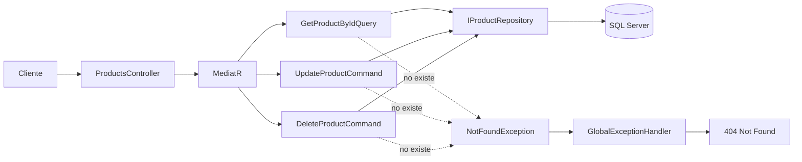

# ProductAPI – Rama feature/product-full-crud

Ciclo de vida completo (CRUD) para la entidad Product: consulta por Id, actualización y eliminación, sobre Clean Architecture y CQRS con MediatR, más el encabezado Location en la creación mediante CreatedAtAction.

## Tabla de contenidos
1. [Objetivo de la rama](#1-objetivo-de-la-rama)
2. [Punto de partida y alcance](#2-punto-de-partida-y-alcance)
3. [Resumen de cambios](#3-resumen-de-cambios)
4. [Desarrollo paso a paso](#4-desarrollo-paso-a-paso)
5. [Casos de uso (Application)](#5-casos-de-uso-application)
6. [Controlador (Api)](#6-controlador-api)
7. [CreatedAtAction y el encabezado Location](#7-createdataction-y-el-encabezado-location)
8. [Referencia de endpoints](#8-referencia-de-endpoints)
9. [Cómo probarlo paso a paso](#9-cómo-probarlo-paso-a-paso)
10. [Mapa de respuestas HTTP](#10-mapa-de-respuestas-http)
11. [Decisiones de diseño y limitaciones conocidas](#11-decisiones-de-diseño-y-limitaciones-conocidas)
12. [Glosario](#12-glosario)
13. [Próximos pasos](#13-próximos-pasos)

---

## 1. Objetivo de la rama
Completar las operaciones Create, Read, Update y Delete de `Product`. Hasta ahora la API solo permitía crear y listar. Con esta rama también permite:
* Buscar un producto por su Id.
* Actualizar su precio y agregar stock.
* Eliminarlo.

Además, aprovecha que ya existe un `GET /api/Products/{id}` para que la creación devuelva el encabezado `Location`, algo que había quedado pendiente en `feature/domain-exceptions`.

---

## 2. Punto de partida y alcance

**Ya existía (ramas anteriores)**
* POST y GET (lista) de Products
* `NotFoundException` y su traducción a 404 (sin uso real)
* `201 Created` sin encabezado Location
* Validación con FluentValidation y manejo global de errores

**Se agrega en esta rama**
* `GET /{id}`, `PUT /{id}`, `DELETE /{id}`
* Primer caso de uso que la lanza: `GetProductByIdQuery`
* `201 Created` con Location (`CreatedAtAction`)

| Incluye | No incluye |
| --- | --- |
| CRUD completo de Product | CRUD de Brands, Categories y Reviews |
| Eliminación física | Eliminación lógica (soft delete) |
| Actualización de precio y stock | Actualización de nombre y descripción |

---

## 3. Resumen de cambios

| # | Cambio | Capa |
| --- | --- | --- |
| 1 | `GetProductByIdQuery` + handler | Application |
| 2 | `UpdateProductCommand` + handler | Application |
| 3 | `DeleteProductCommand` + handler | Application |
| 4 | Nuevas operaciones en `IProductRepository` y `ProductRepository` | Application / Infrastructure |
| 5 | Endpoints `GET /{id}`, `PUT /{id}`, `DELETE /{id}` | Api |
| 6 | POST usa `CreatedAtAction` en lugar de `StatusCode(201)` | Api |

**Flujo general**


---

## 4. Desarrollo paso a paso

### 4.1 Crear la rama
```bash
git checkout main
git pull origin main
git checkout -b feature/product-full-crud
```

### 4.2 Extender el repositorio
En `IProductRepository` (Application) se agregan las operaciones que necesitan los nuevos casos de uso (obtener por Id, actualizar y eliminar). Después se implementan en `ProductRepository` (Infrastructure).

### 4.3 Crear los casos de uso
Por cada operación, un mensaje y su handler:
| Operación | Mensaje | Handler |
| --- | --- | --- |
| Consultar por Id | `GetProductByIdQuery` | `GetProductByIdQueryHandler` |
| Actualizar | `UpdateProductCommand` | `UpdateProductCommandHandler` |
| Eliminar | `DeleteProductCommand` | `DeleteProductCommandHandler` |

### 4.4 Agregar los endpoints al controlador
Endpoints GET /{id}, PUT /{id}, DELETE /{id}.

### 4.5 Cambiar el POST a CreatedAtAction
Devolver 201 Created apuntando a GET /{id}.

### 4.6 Commits y Pull Request
```bash
git add .
git commit -m "feat: add GetById, Update and Delete use cases for Product"
git push -u origin feature/product-full-crud
```

---

## 5. Casos de uso (Application)

### 5.1 GetProductByIdQuery
* **Tipo:** Query
* **Entrada:** Guid del producto
* **Salida:** ProductDto
* **Si no existe:** Lanza `NotFoundException` -> el middleware global responde 404

### 5.2 UpdateProductCommand
* **Tipo:** Command
* **Entrada:** Id, nuevo Price, StockToAdd
* **Salida:** Nada (204 No Content)
* **Reglas:** Reutiliza los métodos del dominio (`UpdatePrice`, `AddStock`). Si el dominio rechaza el valor, lanza `DomainException` (400).

### 5.3 DeleteProductCommand
* **Tipo:** Command
* **Entrada:** Guid del producto
* **Salida:** Nada (204 No Content)
* **Tipo de borrado:** Físico.
* **Si no existe:** 404.

---

## 6. Controlador (Api)
Endpoints agregados a `ProductsController`:

| Elemento | Explicación |
| --- | --- |
| `{id:guid}` | Restricción de ruta: solo acepta Guid válidos; con otro valor responde 404 sin entrar a la acción. |
| `NoContent()` | 204: la operación tuvo éxito y no hay cuerpo que devolver. |
| Sin `try/catch` | Las excepciones las resuelve el `GlobalExceptionHandler`. |

---

## 7. CreatedAtAction y el encabezado Location

**Antes:** `return StatusCode(StatusCodes.Status201Created, ...);`
**Después:** `return CreatedAtAction(nameof(GetProductById), new { id = productId }, ...);`

**Qué produce:**
```http
HTTP/1.1 201 Created
Content-Type: application/json
Location: https://localhost:7112/api/Products/3fa85f64-...
```

---

## 8. Referencia de endpoints
Base: `/api/Products`

| Método | Ruta | Descripción | Éxito | Errores |
| --- | --- | --- | --- | --- |
| POST | `/` | Crear producto | 201 Created + Location | 400 (validación o regla) |
| GET | `/` | Listar productos | 200 OK | — |
| GET | `/{id}` | Obtener por Id | 200 OK | 404 |
| PUT | `/{id}` | Actualizar precio y stock | 204 No Content | 400, 404 |
| DELETE | `/{id}` | Eliminar | 204 No Content | 404 |

---

## 9. Cómo probarlo paso a paso

### 9.1 Recorrido completo del CRUD
1. `POST /api/Categories` -> 201. Copiar Id.
2. `POST /api/Brands` -> 201. Copiar Id.
3. `POST /api/Products` -> 201 + Location. Copiar Id.
4. `GET /api/Products/{id}` -> 200.
5. `PUT /api/Products/{id}` -> 204.
6. `GET /api/Products/{id}` -> 200 (datos actualizados).
7. `DELETE /api/Products/{id}` -> 204.
8. `GET /api/Products/{id}` -> 404.

---

## 10. Mapa de respuestas HTTP

| Situación | Origen | Código |
| --- | --- | --- |
| Producto creado | POST | 201 + Location |
| Producto encontrado | GET /{id} | 200 |
| Producto actualizado | PUT /{id} | 204 |
| Producto eliminado | DELETE /{id} | 204 |
| Producto no encontrado | `NotFoundException` | 404 |
| Dato de entrada inválido | `ValidationException` | 400 |
| Regla de negocio rota | `DomainException` | 400 |
| CategoryId inexistente (FK) | Excepción de EF Core | 500 |

---

## 11. Decisiones de diseño y limitaciones conocidas

| Tema | Estado actual | Mejora sugerida |
| --- | --- | --- |
| PUT no es idempotente | `stockToAdd` suma al stock cada vez que se llama | Usar PATCH o endpoint específico |
| Alcance del PUT | Solo actualiza precio y stock | Agregar métodos de renombre en Product |
| Id duplicado en ruta y cuerpo | `PUT /{id}` recibe el Id también en el cuerpo | Rechazar con 400 si no coinciden |
| Eliminación física | El registro se pierde definitivamente | Implementar Soft Delete |
| Concurrencia | Dos peticiones pueden sobrescribir stock | Token de concurrencia (rowversion) |

---

## 12. Glosario
| Término | Definición |
| --- | --- |
| **CRUD** | Create, Read, Update, Delete |
| **204 No Content** | Éxito sin cuerpo que devolver |
| **Location** | Encabezado HTTP con URL del recurso creado |
| **CreatedAtAction** | Método ASP.NET que devuelve 201 y el Location |
| **Idempotente** | Operación que produce el mismo resultado si se repite múltiples veces |
| **Eliminación lógica** | Marcar registro como eliminado sin borrarlo físicamente |

---

## 13. Próximos pasos
* Replicar el CRUD en Brands, Categories y Reviews.
* Revisar diseño de PUT e Idempotencia.
* Soft delete y concurrencia.
* Paginación en consultas de listado.
