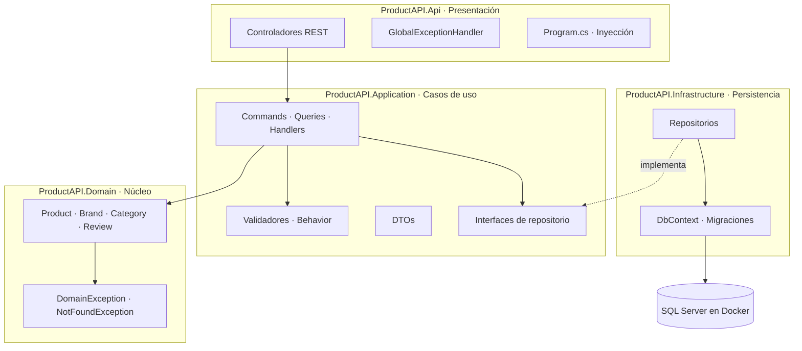
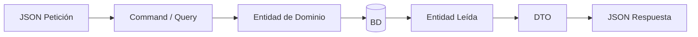

# ProductAPI

API RESTful de gestión de productos construida con **.NET 8**, siguiendo fielmente los principios de **Clean Architecture** y **CQRS**. Cuenta con un modelo de dominio rico (entidades con comportamiento y reglas de negocio encapsuladas).

El proyecto sirve como pieza de portafolio para mostrar cómo separar la lógica de negocio del framework web y de la base de datos, y cómo manejar validaciones, errores y semántica REST de forma escalable y consistente.

---

## Tabla de contenidos
1. [Características principales](#1-caracter%C3%ADsticas-principales)
2. [Stack tecnológico](#2-stack-tecnol%C3%B3gico)
3. [Arquitectura y Filosofía](#3-arquitectura-y-filosof%C3%ADa)
4. [Estructura de la solución](#4-estructura-de-la-soluci%C3%B3n)
5. [Patrones y decisiones de diseño](#5-patrones-y-decisiones-de-dise%C3%B1o)
6. [Endpoints](#6-endpoints)
7. [Manejo de errores](#7-manejo-de-errores)
8. [Puesta en marcha local (Docker)](#8-puesta-en-marcha-local-docker)
9. [Primeros pasos con la API](#9-primeros-pasos-con-la-api)
10. [Documentación por rama (Historial de Evolución)](#10-documentaci%C3%B3n-por-rama)
11. [Roadmap y Limitaciones Conocidas](#11-roadmap-y-limitaciones-conocidas)

---

## 1. Características principales
* **CRUD completo de 4 entidades:** Product, Brand, Category y Review (20 endpoints).
* **CQRS con MediatR:** Cada operación es un Command o una Query con su propio handler, manteniendo la Responsabilidad Única.
* **Validación en Pipeline:** Uso de FluentValidation mediante un Pipeline Behavior de MediatR para interceptar comandos inválidos automáticamente.
* **Manejo Global de Excepciones:** `IExceptionHandler` de .NET 8 que estandariza las salidas bajo el RFC 9457 (`ProblemDetails`).
* **Excepciones de Dominio:** Lanzadas desde el núcleo (`DomainException`, `NotFoundException`) y traducidas mágicamente a códigos HTTP 400 y 404 en el Middleware.
* **Semántica REST Pura:**
  * `201 Created` con encabezado `Location` usando `CreatedAtAction`.
  * `204 No Content` en actualizaciones (PUT) y eliminaciones (DELETE).
* **Docker y EF Core:** SQL Server 2022 montado en contenedores y gestionado mediante Migraciones First-Code.

---

## 2. Stack tecnológico
| Categoría | Tecnología |
| --- | --- |
| **Framework** | .NET 8 |
| **Lenguaje** | C# 12 |
| **Base de datos** | SQL Server 2022 (Docker) |
| **ORM** | Entity Framework Core |
| **Mensajería / CQRS** | MediatR |
| **Validación** | FluentValidation |
| **Documentación API** | Swagger (`Swashbuckle.AspNetCore`) |
| **Pruebas** | xUnit / Moq / FluentAssertions (en `ProductAPI.Domain.Tests`) |

---

## 3. Arquitectura y Filosofía
El proyecto emplea **Clean Architecture**. Las dependencias siempre apuntan hacia el dominio central, de modo que las reglas de negocio no dependen ni de la base de datos ni de la red.



### 3.1 Qué objeto viaja entre capas
La transformación de los objetos evita que detalles como la estructura de las tablas o el JSON afecten al modelo central de negocio.


***⭐ Mi Cosecha:** Las entidades del dominio **NUNCA** escapan de la API. Se mapean cuidadosamente a un DTO. Esto asegura que cambiar una columna en la base de datos o en la entidad no rompa silenciosamente las integraciones de los clientes frontend.*

### 3.2 Inversión de Dependencias (El Secreto de la Arquitectura Limpia)
El caso de uso (Capa Application) nunca sabe cómo conectarse a SQL Server. Solo dice: *"Necesito algo que cumpla con `IProductRepository`"*. Es el contenedor de inyección de dependencias (`Program.cs`) quien, en tiempo de ejecución, le inyecta la implementación real `ProductRepository` de la capa de Infraestructura. Esto permite cambiar SQL Server por PostgreSQL en 5 minutos o hacer testing sin base de datos real usando mocks.

---

## 4. Estructura de la solución
```text
ProductAPI/
├── ProductAPI.sln
├── docker-compose.yml 
├── ProductAPI.Domain/
│   ├── Entities/         # Product, Brand, Category, Review (con comportamiento rico)
│   └── Exceptions/       # DomainException, NotFoundException
├── ProductAPI.Domain.Tests/
├── ProductAPI.Application/
│   ├── Behaviors/        # ValidationBehavior (Middleware de MediatR)
│   └── Features/         # Commands, Queries, Handlers y Validators por entidad
├── ProductAPI.Infrastructure/
│   ├── Repositories/     # Implementaciones de Repositorios con EF Core
│   └── Migrations/
└── ProductAPI.Api/
    ├── Controllers/
    ├── Middlewares/      # GlobalExceptionHandler (IExceptionHandler)
    └── Program.cs
```

---

## 5. Patrones y decisiones de diseño

* **Modelo de dominio rico (DDD):** Las entidades no son simples bolsas de *getters* y *setters*. Protegen su estado con `private set` y exponen métodos semánticos (`UpdatePrice`, `AddStock`). No se puede dejar el stock negativo desde fuera de la clase.
* **CQRS con MediatR:** Se separó explícitamente la lectura de la escritura. Los Controladores son "flacos" (no tienen lógica alguna).
* **Fail Fast Pipeline:** Las validaciones de entrada (`FluentValidation`) cortan la petición en Application antes de siquiera tocar la base de datos o instanciar entidades.
* **Idempotencia Híbrida:** En su estado actual, la mayoría de los `PUT` son reemplazos completos (Idempotentes).

---

## 6. Endpoints
| Entidad | Ruta base |
| --- | --- |
| Productos | `/api/Products` |
| Marcas | `/api/Brands` |
| Categorías | `/api/Categories` |
| Reseñas | `/api/Reviews` |

Para cada entidad existen 5 operaciones estándar:
* **POST `/`** : 201 Created + Header `Location`
* **GET `/`** : 200 OK
* **GET `/{id}`** : 200 OK o 404 Not Found
* **PUT `/{id}`** : 204 No Content o 400/404
* **DELETE `/{id}`** : 204 No Content o 404

---

## 7. Manejo de errores
El `GlobalExceptionHandler` (`IExceptionHandler`) nos ha librado de los `try/catch` manuales. Toda excepción se empaqueta en `ProblemDetails`.

* `ValidationException` -> **400 Bad Request**
* `DomainException` -> **400 Bad Request**
* `NotFoundException` -> **404 Not Found**
* Otros Errores (Ej. Llaves Foráneas) -> **500 Internal Server Error**

---

## 8. Puesta en marcha local (Docker)

1. Clonar el repo: `git clone https://github.com/Alger125/ProductAPI.git`
2. Levantar el contenedor de la BD:
   ```bash
   docker run -e "ACCEPT_EULA=Y" -e "MSSQL_SA_PASSWORD=TuPassword123!" -p 1433:1433 -d mcr.microsoft.com/mssql/server:2022-latest
   ```
3. Editar `appsettings.Development.json` con las credenciales de tu contenedor.
4. Aplicar Migraciones:
   ```bash
   dotnet ef database update --project ProductAPI.Infrastructure --startup-project ProductAPI.Api
   ```
5. ¡Ejecutar! 
   ```bash
   dotnet run --project ProductAPI.Api
   ```
*(Swagger estará disponible en `https://localhost:<puerto>/swagger`)*

---

## 9. Primeros pasos con la API
Para no romper la **Integridad Referencial**, debes crear las dependencias en este orden exacto:
1. Crear **Category** y copiar su ID.
2. Crear **Brand** y copiar su ID.
3. Crear **Product** pasándole los IDs anteriores.
4. Crear **Review** pasándole el ID del producto recién creado.

---

## 10. Documentación por rama
La evolución del sistema quedó registrada en las ramas de Git:
1. `feature/product-domain` : Entidades encapsuladas.
2. `feature/ef-core-sqlserver` : Docker, Migraciones e Infra.
3. `feature/product-usecases` : MediatR, CQRS y DTOs.
4. `feature/error-handling-validation` : Middleware Global y Validaciones.
5. `feature/domain-exceptions` : Excepciones limpias.
6. `feature/product-full-crud` : 201 Created y Endpoints CRUD.
7. `feature/full-crud-all-entities` : CRUD universal para las 4 entidades.

---

## 11. Roadmap y Limitaciones Conocidas
El proyecto es una base sólida, pero listo para expandirse:
* **[WIP] Soft Delete:** Filtrado global de consultas en EF Core y marcadores `IsDeleted`.
* **[WIP] Paginación y Sorting:** Evitar listados masivos en los `GetAll`.
* **[WIP] Control de Concurrencia:** Utilizar `RowVersion` en Entity Framework para devolver `409 Conflict` cuando dos usuarios intentan actualizar el mismo registro simultáneamente.
* **[WIP] Autenticación JWT:** Blindar los endpoints de modificación (POST/PUT/DELETE) solo para administradores.
