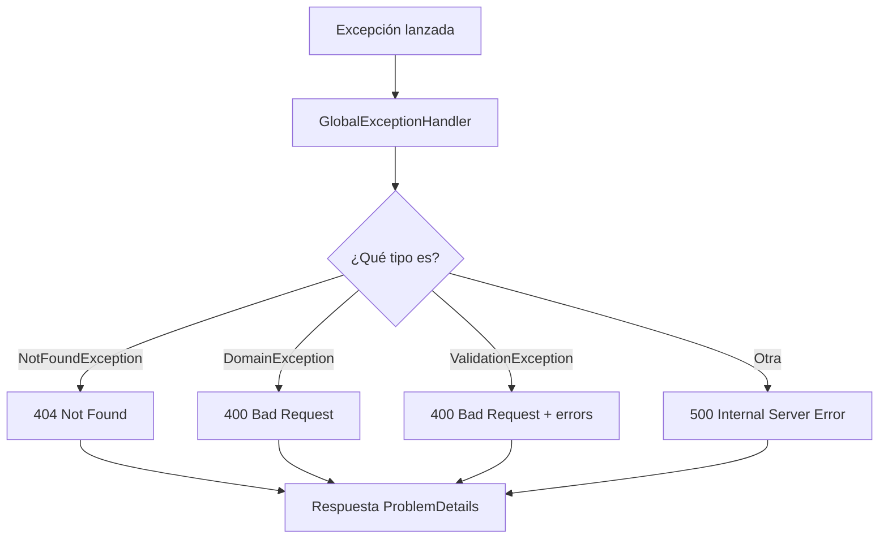

# ProductAPI – Rama feature/domain-exceptions

Excepciones propias del dominio (`DomainException`, `NotFoundException`), su traducción a códigos HTTP en el manejador global de errores y respuestas 201 Created en los controladores, para alinear la API con los estándares REST.

## Tabla de contenidos
1. [Objetivo de la rama](#1-objetivo-de-la-rama)
2. [Punto de partida y problema a resolver](#2-punto-de-partida-y-problema-a-resolver)
3. [Resumen de cambios](#3-resumen-de-cambios)
4. [Desarrollo paso a paso](#4-desarrollo-paso-a-paso)
5. [Excepciones personalizadas del dominio](#5-excepciones-personalizadas-del-dominio)
6. [Refactorización de la entidad Product](#6-refactorización-de-la-entidad-product)
7. [Cambios en GlobalExceptionHandler](#7-cambios-en-globalexceptionhandler)
8. [Respuestas 201 Created en los controladores](#8-respuestas-201-created-en-los-controladores)
9. [Pruebas](#9-pruebas)
10. [Mapa de respuestas HTTP](#10-mapa-de-respuestas-http)
11. [Qué se gana con estos cambios](#11-qué-se-gana-con-estos-cambios)
12. [Decisiones de diseño y limitaciones conocidas](#12-decisiones-de-diseño-y-limitaciones-conocidas)
13. [Glosario](#13-glosario)
14. [Próximos pasos](#14-próximos-pasos)

---

## 1. Objetivo de la rama
Refinar la forma en que la API responde y comunica errores:
* Reemplazar las excepciones genéricas de .NET en el dominio por excepciones semánticas propias.
* Hacer que el `GlobalExceptionHandler` entienda ese lenguaje de negocio y responda con 400 o 404.
* Devolver `201 Created` (en lugar de `200 OK`) cuando una petición POST crea un recurso.

---

## 2. Punto de partida y problema a resolver
Al terminar `feature/error-handling-validation`, el dominio lanzaba `ArgumentException` e `InvalidOperationException` para representar reglas de negocio rotas, y el manejador global las traducía a 400.

Eso tiene un problema de ambigüedad: esas dos excepciones las usa todo el framework y las librerías de terceros, no solo nuestro dominio.

| Situación | Excepción | Respuesta antes de esta rama |
| --- | --- | --- |
| Precio negativo en Product | `ArgumentException` | 400 (correcto) |
| Bug en componente del framework | `InvalidOperationException` | 400 (incorrecto: es un error del servidor) |

El manejador no podía distinguir un error de negocio de un error de programación. Con una excepción propia, un `DomainException` siempre significa "se rompió una regla de negocio".

Además, las creaciones respondían `200 OK`, cuando el estándar HTTP indica `201 Created`.

---

## 3. Resumen de cambios

| # | Cambio | Capa | Archivos |
| --- | --- | --- | --- |
| 1 | Crear `DomainException` y `NotFoundException` | **Domain** | `Exceptions/` |
| 2 | `Product` lanza `DomainException` en lugar de nativas | **Domain** | `Entities/Product.cs` |
| 3 | El manejador global traduce a 400 y 404 | **Api** | `Middlewares/GlobalExceptionHandler.cs` |
| 4 | Los POST devuelven `201 Created` | **Api** | 4 controladores |

---

## 4. Desarrollo paso a paso

### 4.1 Crear la rama
```bash
git checkout main
git pull origin main
git checkout -b feature/domain-exceptions
```

### 4.2 Crear la carpeta y las excepciones (Domain)
```bash
mkdir ProductAPI.Domain/Exceptions
```

### 4.3 Refactorizar Product
Reemplazar excepciones nativas por `DomainException`.

### 4.4 Actualizar el GlobalExceptionHandler (Api)
Agregar las ramas para `DomainException` y `NotFoundException`.

### 4.5 Cambiar los controladores a 201 Created
Modificar la acción POST de todos los controladores.

### 4.6 Commits y Pull Request
```bash
git add .
git commit -m "feat: add domain exceptions and return 201 Created on POST"
git push -u origin feature/domain-exceptions
```

---

## 5. Excepciones personalizadas del dominio
Ubicación: `ProductAPI.Domain/Exceptions/`

| Excepción | Cuándo se usa | Respuesta HTTP |
| --- | --- | --- |
| `DomainException` | Se rompe una regla de negocio | 400 Bad Request |
| `NotFoundException`| Se busca un identificador que no existe | 404 Not Found |

**Sobre "el dominio no debe depender de excepciones del sistema"**
Las nuevas excepciones siguen heredando de `System.Exception` (que es parte de la biblioteca base de .NET). Lo que cambia no es la dependencia técnica, sino el **significado**:

| | `ArgumentException` | `DomainException` |
| --- | --- | --- |
| **Quién las lanza** | Dominio, framework y librerías | Solo el dominio |
| **Significado** | Genérico | "Regla de negocio rota" |
| **Mapeo a 400 seguro** | No (hay falsos positivos) | Sí |

---

## 6. Refactorización de la entidad Product

**Tabla de equivalencias**
| Método | Regla | Antes | Ahora |
| --- | --- | --- | --- |
| `UpdatePrice` | Precio no negativo | `ArgumentException` | `DomainException` |
| `AddStock` | Cantidad no negativa| `ArgumentException` | `DomainException` |
| `RemoveStock` | Cantidad mayor a 0 | `ArgumentException` | `DomainException` |
| `RemoveStock` | Stock suficiente | `InvalidOperationException` | `DomainException` |

Las reglas no cambian; cambia solo el tipo de excepción.

---

## 7. Cambios en GlobalExceptionHandler

El manejador entiende las dos excepciones nuevas:

| Excepción | Código | Estado |
| --- | --- | --- |
| `NotFoundException` | 404 Not Found | Listo; se usará cuando existan consultas por Id |
| `DomainException` | 400 Bad Request | Activo |
| `ValidationException` | 400 Bad Request | Activo |
| Cualquier otra | 500 Internal Server Error | Activo |



---

## 8. Respuestas 201 Created en los controladores

### 8.1 Por qué 201 y no 200
| Código | Significado | Cuándo usarlo |
| --- | --- | --- |
| `200 OK` | La petición tuvo éxito | Lecturas y actualizaciones |
| `201 Created` | Se creó un recurso nuevo | Respuesta de un POST que crea algo |

### 8.2 Controladores actualizados
| Controlador | Acción POST | Código anterior | Código actual |
| --- | --- | --- | --- |
| `ProductsController` | Crear producto | 200 | 201 |
| `BrandsController` | Crear marca | 200 | 201 |
| `CategoriesController`| Crear categoría | 200 | 201 |
| `ReviewsController` | Crear reseña | 200 | 201 |

*(La respuesta ideal incluiría `Location` y `CreatedAtAction`, pero esto requiere los endpoints GET por Id que aún no existen).*

---

## 9. Pruebas

Los tests de dominio deberían ser actualizados para esperar una `DomainException` en vez de excepciones nativas.

Para probar la respuesta HTTP en Swagger, el resultado en creaciones exitosas ahora marca `201 Created`. Los errores de validación de entradas siguen saliendo como `400` capturados por FluentValidation en la capa de Aplicación.

---

## 10. Mapa de respuestas HTTP

| Situación | Excepción | Código |
| --- | --- | --- |
| Recurso creado correctamente (POST) | (ninguna) | **201 Created** |
| Datos de entrada inválidos (validador) | `ValidationException` | **400** |
| Regla de negocio rota en el dominio | `DomainException` | **400** |
| Recurso inexistente | `NotFoundException` | **404** *(próximamente)* |
| CategoryId inexistente (FK BD) | Excepción de EF Core | **500** |

---

## 11. Qué se gana con estos cambios
* **Semántica REST:** creaciones como 201, reglas rotas como 400 y no encontrados como 404.
* **Intención explícita:** `DomainException` significa siempre "regla de negocio rota".
* **Mapeo seguro:** el manejador global ya no depende de tipos genéricos.
* **ProblemDetails consistente:** las excepciones usan el formato estándar.

---

## 12. Decisiones de diseño y limitaciones conocidas

| Tema | Estado actual | Mejora sugerida |
| --- | --- | --- |
| Ramas antiguas | El manejador ya no atrapa genéricas como negocio | Correcto |
| `NotFoundException` en Domain | Vive en la capa de dominio | Discutible; algunos prefieren Application |
| 404 sin uso real | Está implementado pero ningún endpoint lo lanza | Implementar consultas por Id |
| 201 sin Location | Falta el encabezado con URL | `CreatedAtAction` cuando exista GET por Id |
| Llave foránea | 500 | Lanzar 404 al verificar |

---

## 13. Glosario
| Término | Definición |
| --- | --- |
| **Excepción de dominio** | Excepción propia que representa regla de negocio rota |
| **REST** | Estilo de API usando verbos y códigos HTTP estándar |
| **201 Created** | Código que indica que se creó un recurso nuevo |
| **404 Not Found** | Código que indica recurso inexistente |
| **Falso positivo** | Tratar como error de negocio algo que es error del sistema |

---

## 14. Próximos pasos
* Consultas por Id (`GetProductByIdQuery`) que lancen `NotFoundException` (404).
* `CreatedAtAction` con el encabezado `Location` en las creaciones.
* Verificar `CategoryId` antes de guardar y responder 404 en lugar de 500.
* Subtipos de `DomainException` (ej. `InsufficientStockException` -> 409).
